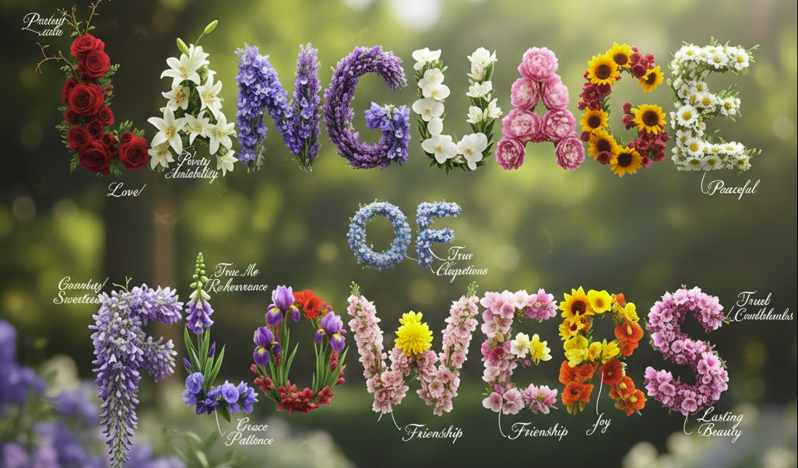

# The Botanical Telegram

> "By the simple language of flowers, the most delicate and refined sentiments may be expressed."

A beautiful, interactive web application for composing messages using the Victorian art of floriography—the language of flowers. Build botanical bouquets that express emotions through carefully selected flowers, each carrying its own symbolic meaning.



## Overview

The Botanical Telegram is a floriography builder that allows you to:

- **Identify Sentiments**: Select from six core emotions (Joy, Love, Sadness, Anger, Fear, Surprise) using an interactive emotion wheel
- **Choose Specific Emotions**: Refine your selection with Victorian-era specific emotions and sentiments
- **Build Bouquets**: Create visual floral arrangements that represent your chosen emotions
- **Understand Meanings**: Learn the symbolic meaning of each flower, including their opposite meanings
- **Customize Presentation**: Adjust the presentation modality (Upright, Inverted, To Heart, Extend) to change the interpretation
- **Explore Dictionary**: Browse a comprehensive dictionary of flowers organized alphabetically

## Features

### Emotion Selection
- Interactive emotion wheel with six primary emotion categories
- Sub-emotion selection with flower previews on hover
- Visual feedback for selected emotions

### Bouquet Builder
- Real-time bouquet visualization as you select emotions
- Automatic synthesis text generation describing your bouquet
- Presentation modality controls to alter flower meanings:
  - **Upright**: Classic meaning
  - **Inverted**: Opposite spirit
  - **To Heart**: From giver's perspective
  - **Extend**: To receiver's perspective

### Multilingual Support
The application supports 9 languages:
- English (EN)
- Spanish (ES)
- German (GE)
- French (FR)
- Polish (PL)
- Hindi (HI)
- Bengali (BN)
- Marathi (MR)
- Telugu (TE)

### Floral Dictionary
- Complete alphabetical dictionary of all flowers
- Multiple meanings per flower
- Opposite meanings for each flower
- Beautiful card-based layout with flower images

## Historical Context

Historical floriography sourced from the archives of Routledge & Sons, established 1884. The application preserves the traditional Victorian meanings and interpretations of flowers, allowing users to compose messages in the authentic language of flowers.

## Technical Details

- **Frontend**: Pure HTML, CSS, and JavaScript
- **Styling**: Tailwind CSS
- **Fonts**: Libre Baskerville (serif) and Inter (sans-serif)
- **Data**: Floral dictionary stored in `floral-data.js`
- **Images**: Flower images stored in the `flower/` directory

## File Structure

```
botanic-telegram/
├── index.html          # Main application page
├── dictionary.html     # Floral dictionary page
├── floral-data.js      # Flower data and meanings
├── language.png        # Language of flowers illustration
├── background.jpg      # Background image
└── flower/            # Directory containing flower images
    ├── daisy.jpg
    ├── red-rose.jpg
    └── ...
```

## Usage

1. Open `index.html` in a web browser
2. Select an emotion category from the emotion wheel
3. Choose specific Victorian emotions from the sub-emotion list
4. Watch your bouquet grow as you select emotions
5. Adjust the presentation modality to change interpretations
6. View the synthesis text describing your bouquet
7. Click "Dictionary" to explore all available flowers

## Browser Compatibility

Works best in modern browsers that support:
- ES6 JavaScript
- CSS Grid and Flexbox
- CSS Custom Properties

## Credits

- Historical floriography data from Routledge & Sons archives (1884)
- Emotion wheel concept based on the Plutchik emotion model
- Flower images and botanical references

---

*Established 1884* | *Historical floriography sourced from the archives of Routledge & Sons.*
